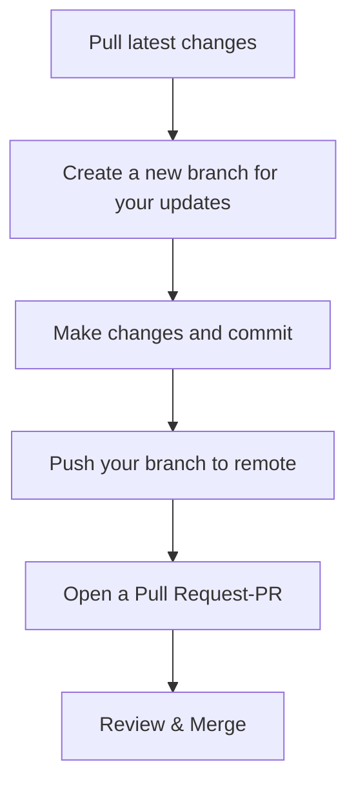

# Git for Technical Writers

## Introduction

Git is a version control system originally designed for developers, but it has become an essential tool for technical writers, too. Whether you're managing documentation for software projects, collaborating with developers, or maintaining a content repository, understanding Git can greatly enhance your productivity and content quality.

In this article, we’ll explore what Git is, why it's useful for technical writers, and how to get started with the basics. All from the perspective of someone who writes, edits, and manages documentation.

## What Is Git?

Git is a distributed version control system. It allows multiple people to work on the same files, track changes over time, and merge contributions from different collaborators. Every user has a complete copy of the project, making it easy to work offline and maintain a full history of all changes.

## Why Should Technical Writers Use Git?

- Version Tracking: Never lose track of changes. Git records every modification.
- Collaboration: Work alongside developers or other writers without overwriting each other's work.
- Branching: Experiment with drafts or new documentation in isolated environments.
- Backup: Because every clone is a full copy, there’s inherent redundancy and protection. 

## Setting Up Git - Quickstart

**Install Git** - Download from [git-scm.com](https://git-scm.com/) and follow the installation guide for your OS.

**Configure Git** - Set your name and email:

```bash linenums="1"
git config --global user.name "Your Name"
git config --global user.email "you@example.com"
```
**Clone a Repository** - If you're working on an existing documentation project:

```bash linenums="1"
git clone https://github.com/yourorg/docs-repo.git
cd docs-repo
```

## A Typical Workflow for Writers


### Step-by-Step Explanation

| **Step**                  | **Command**                                            | **Explanation**                                                                 |
|---------------------------|---------------------------------------------------------|---------------------------------------------------------------------------------|
| **Pull Latest Changes**   | `git pull origin main`                                 | Fetches the latest updates from the main branch to ensure your local copy is up to date. |
| **Create a New Branch**   | `git checkout -b update-installation-guide`            | Creates and switches to a new branch where your updates will be safely isolated. |
| **Make Changes**          | *(Edit files as needed)*                               | Modify or add files (e.g., update `install.md`) to improve documentation.        |
| **Stage Changes**         | `git add docs/install.md`                              | Marks the updated file(s) to be included in the next commit.                     |
| **Commit Changes**        | `git commit -m "Clarified installation steps"`         | Saves your staged changes with a meaningful message describing what was done.    |
| **Push Branch to Remote** | `git push origin update-installation-guide`            | Uploads your new branch and commits to the remote repository.                    |
| **Open Pull Request (PR)**| *(Use GitHub, GitLab, or Bitbucket)*                   | Opens a request for team review, allowing others to comment, approve, or suggest changes. |
| **Review & Merge**        | *(Team reviews and merges the PR into `main`)*         | Final step where changes are approved and merged into the main branch.           |

Whether you're maintaining a user guide, updating API documentation, or managing contributions across teams, Git provides the structure and reliability needed to scale your documentation efforts.
